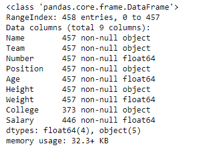

# 📊 Pandas

Pandas is a powerful **data analysis library in Python** used to work with structured data such as CSV and Excel files.

---

## 📦 Installation

```bash
pip install pandas
```

---

## 📌 What is a DataFrame?

A **DataFrame** is a 2D data structure (rows and columns), similar to a table or spreadsheet.  
Each column can have different data types, and operations can be performed efficiently.

---

## 📥 Reading a CSV File

```python
import pandas as pd

df = pd.read_csv("movies.csv")
```


Reads the CSV file and loads it into a DataFrame.

---

## 🔍 Viewing Data

```python
df.head(7)
```
Returns the first 7 rows.

```python
df.tail(4)
```
Returns the last 4 rows.

```python
df.sample(5)
```
Returns 5 random rows.

### Slicing

```python
df[2:6]
```
Selects rows from index 2 to 5 (end index is exclusive).

---

## 📐 Shape of Data

```python
df.shape
```

- Output: `(37, 10)` → 37 rows and 10 columns

---

## 📌 Accessing Columns

```python
df["name"]   # Preferred
df.name      # Not always safe
```

---

## ⚙️ Exploring Functions

```python
dir(df["name"])
```

Lists all available methods for the column.

---

## 📊 Basic Statistics

```python
df["imdb"].min()
df["imdb"].max()
df["imdb"].mean()
```

Computes minimum, maximum, and average values.

---

## 🔎 Filtering Data

```python
df_t = df[df["industry"] == "tollywood"]
df_h = df[df["industry"] == "hollywood"]
```

Filters rows and stores results in new DataFrames.

### Multiple Conditions

```python
df[(df["year"] > 2000) & (df["studio"] == "marvel")]
```

Applies multiple conditions using AND (`&`).

---

## 📚 DataFrame Basics

### Unique Values

```python
df["industry"].unique()
```

Returns distinct values like Tollywood, Hollywood.

---

### Value Counts

```python
df["industry"].value_counts()
```

Counts occurrences of each category.

Example:
```
Tollywood    20
Hollywood    12
Name: industry
```

---

### Selecting Columns

```python
df_new = df[["title", "imdb"]]
```

Creates a new DataFrame with selected columns.

---

## 📈 Summary Statistics

```python
df.describe()
```


Provides statistical summary of numeric columns.

---

## ℹ️ Data Information

```python
df.info()
```



Displays column names, data types, and non-null counts.

---

## ➕ Creating New Columns

```python
df["age"] = df["year"].apply(lambda x: 2026 - x)
```

Creates a new column `age` based on year.

```python
df["profit"] = df.apply(lambda x: x["revenue"] - x["budget"], axis=1)
```

- `axis=1` → operation is applied row-wise

---

## 📌 Index Operations

```python
df.index
```

Returns the index range.

```python
df.set_index("title", inplace=True)
```

Sets `title` as index.

```python
df.loc["RRR"]
```

Access row using index label.

```python
df.iloc[0]
```

Access row using integer position.

```python
df.reset_index()
```

Resets index to default.

---

## 📄 CSV Handling

```python
df = pd.read_csv("stock.csv", skiprows=1)
```

Skips the first row.

### Additional Parameters

- `header=1` → use second row as header  
- `nrows=2` → read limited rows  

```python
df = pd.read_csv("stock.csv", na_values={"price": ["not available"]})
```

Converts specified values into `NaN`.

---

### Creating New Column

```python
df["pe"] = df["price"] / df["eps"]
```

---

### Exporting to CSV

```python
df.to_csv("pe.csv", index=False, header=False)
```

- `index=False` → removes index  
- `header=False` → removes column names  

---

## 📊 Excel Handling

### Installation

```bash
pip install openpyxl
```

---

### Reading Excel

```python
df_movies = pd.read_excel("movies.xlsx", sheet_name="movies")
```

Reads data from a specific sheet.

---

### Using Converters

```python
def standardized(curr):
    if curr == "$":
        return "USD"
    return curr

df_finance = pd.read_excel(
    "movies.xlsx",
    sheet_name="finance",
    converters={"currency": standardized}
)
```

Applies a custom function while loading data.

---

### Merging DataFrames

```python
df_merged = pd.merge(df_movies, df_finance, on="movie_id")
```

Merges two DataFrames using a common column.

---

### Writing to Excel

```python
df_merged.to_excel("movies_merged.xlsx", sheet_name="merged", index=False)
```

Exports DataFrame to Excel.

---

## 🏗️ Creating a DataFrame

```python
df_stocks = pd.DataFrame({
    "tickers": ["Google", "Apple"],
    "price": [112, 221]
})
```

Creates a DataFrame using a dictionary.

---

### Writing Multiple Sheets

```python
with pd.ExcelWriter("Stock_Movie.xlsx") as writer:
    df_stocks.to_excel(writer, sheet_name="stocks", index=False)
    df_movies.to_excel(writer, sheet_name="movies", index=False)
```

Writes multiple DataFrames into different Excel sheets.

---

## ⚠️ Notes

- Prefer `df["column"]` over `df.column`  
- Use `&` (AND) and `|` (OR) for filtering  
- Wrap conditions in parentheses  

---

## 🎯 Summary

Typical workflow:
1. Read data  
2. Explore  
3. Clean  
4. Analyze  
5. Export  